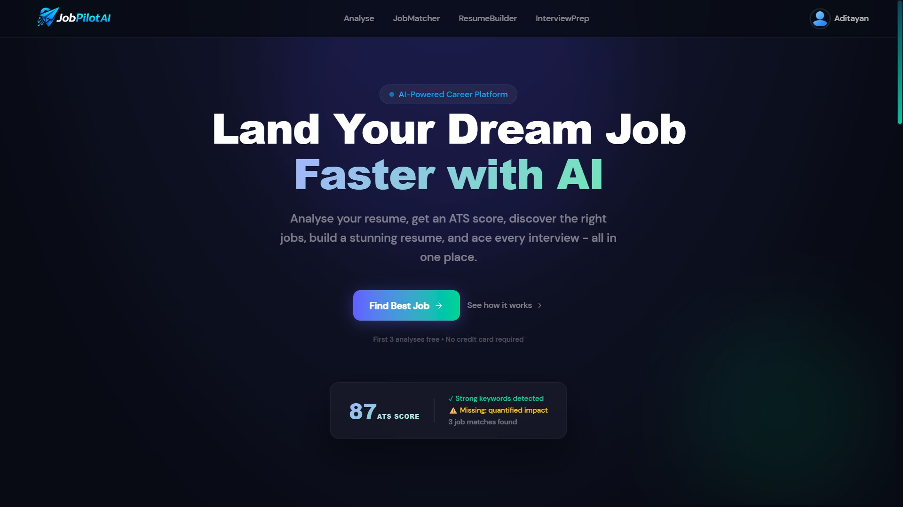
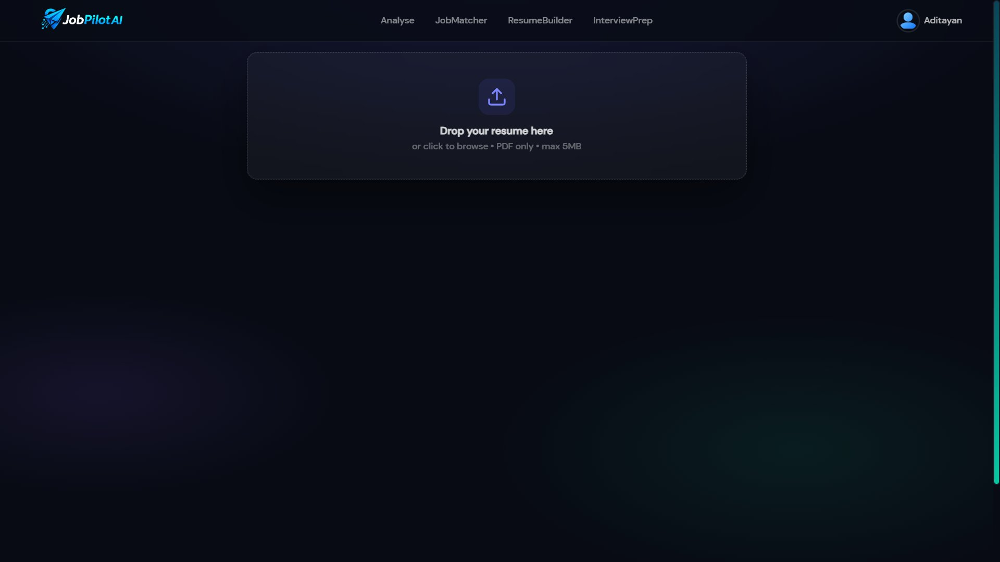
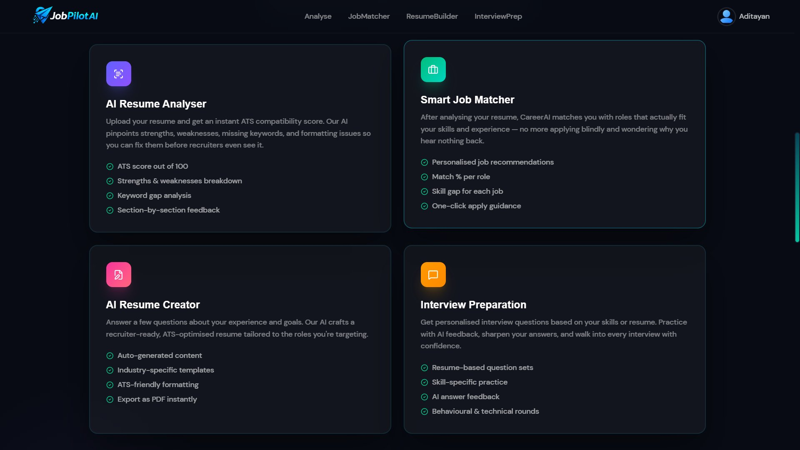
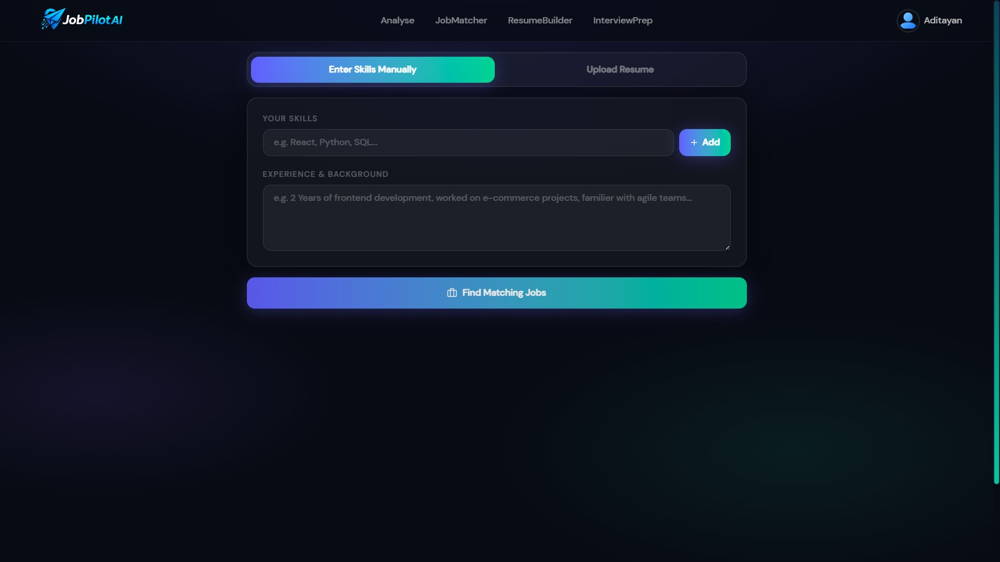
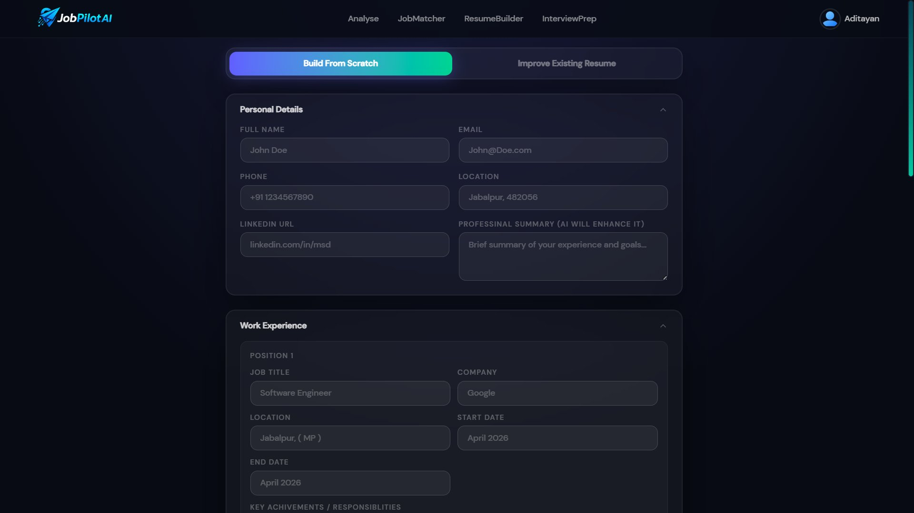
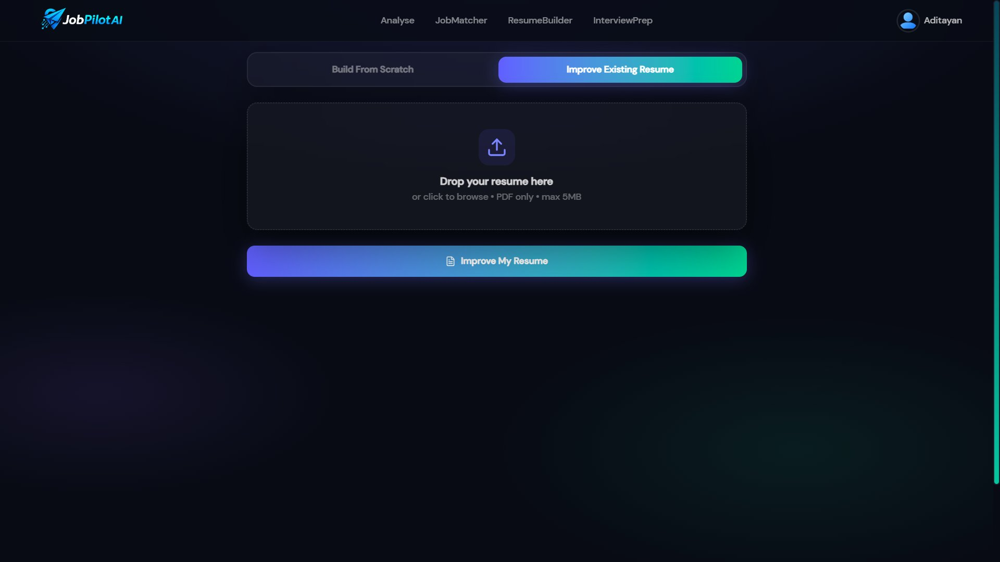
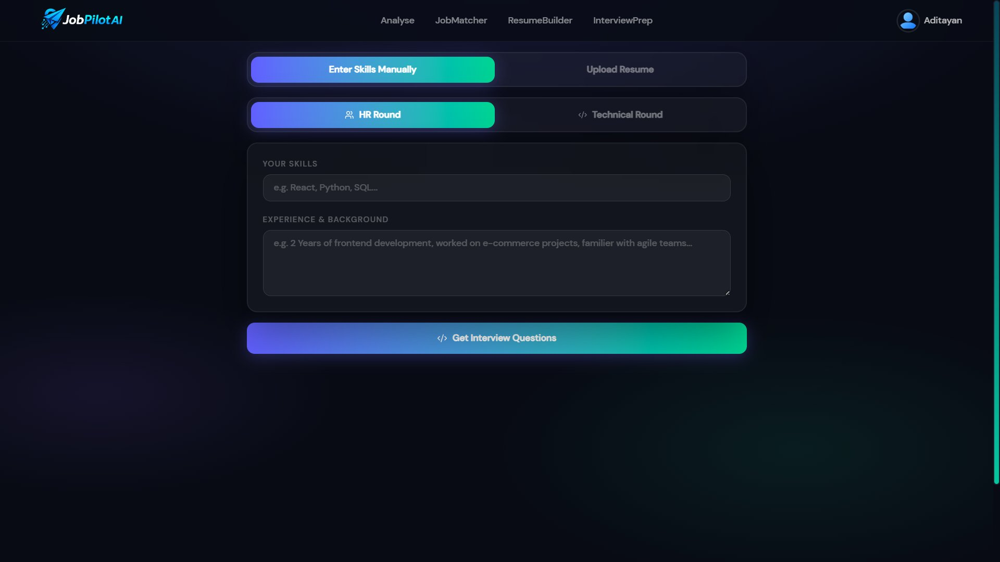
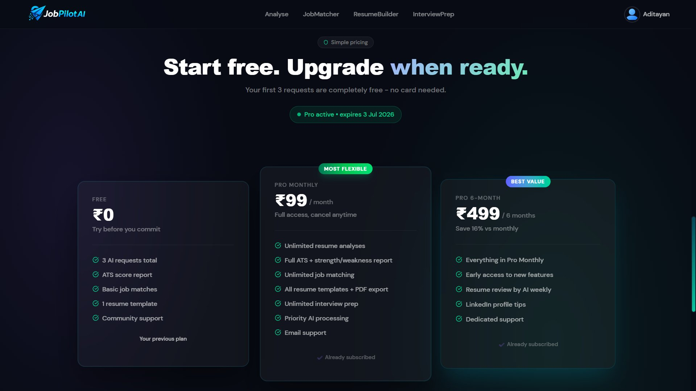
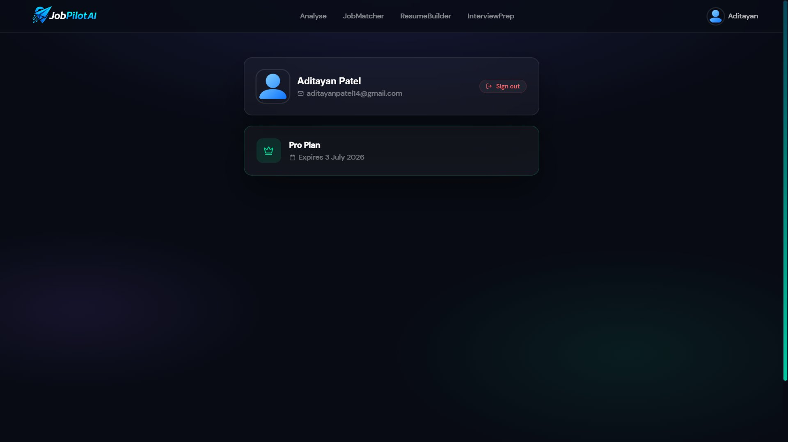

<div align="center">

# 🚀 JobPilot AI — AI-Powered Career Platform

**Analyse your resume, get an ATS score, discover the right jobs, build a stunning resume, and ace every interview — all in one place.**

[](https://jobpilotai-aditayan.vercel.app/)
[](https://www.typescriptlang.org/)
[](https://react.dev/)
[](https://vitejs.dev/)
[](https://tailwindcss.com/)
[](https://eslint.org/)
[](https://reactrouter.com/)

<br/>



</div>

---

## 📌 Table of Contents

- [About the Project](#-about-the-project)
- [App Screenshots](#-app-screenshots)
- [Features](#-features)
- [Tech Stack](#-tech-stack)
- [Getting Started](#-getting-started)
  - [Prerequisites](#prerequisites)
  - [Installation](#installation)
  - [Running Locally](#running-locally)
- [Project Structure](#-project-structure)
- [Environment Variables](#-environment-variables)
- [Pricing Plans](#-pricing-plans)
- [Deployment](#-deployment)
- [Contributing](#-contributing)
- [Author](#-author)

---

## 📖 About the Project

**JobPilot AI** is a full-featured, AI-powered career platform designed to help job seekers at every step of their job hunt. From analysing your resume for ATS compatibility, to matching you with the right jobs, building a professional resume from scratch, and preparing you for interviews — JobPilot AI does it all.

Whether you're a fresher applying for your first job or an experienced professional switching careers, JobPilot AI gives you the edge you need to land your dream job faster.

> 🔗 **Live:** [https://jobpilotai-aditayan.vercel.app/](https://jobpilotai-aditayan.vercel.app/)

---

## 📸 App Screenshots

### 🏠 Hero — Landing Page


---

### 🔍 Resume Analyser — Upload Page


---

### ✨ Features Overview


---

### 💼 Job Matcher


---

### 📝 Resume Builder — Build From Scratch


---

### 🛠 Resume Builder — Improve Existing Resume


---

### 🎤 Interview Prep


---

### 💰 Pricing Plans


---

### 👤 User Profile


---

## ✨ Features

| Feature | Description |
|---------|-------------|
| 🤖 **AI Resume Analyser** | Upload your resume and get an instant ATS score out of 100, strengths & weaknesses breakdown, keyword gap analysis, and section-by-section feedback |
| 💼 **Smart Job Matcher** | AI matches you with roles that fit your skills — includes match % per role, skill gap for each job, and one-click apply guidance |
| 📄 **AI Resume Creator** | Build a recruiter-ready, ATS-optimised resume from scratch or improve your existing one — export as PDF instantly |
| 🎤 **Interview Preparation** | Get personalised interview questions for both HR and Technical rounds based on your skills and resume, with AI answer feedback |
| 💰 **Flexible Pricing** | Start free with 3 AI requests — upgrade to Pro Monthly (₹99/mo) or Pro 6-Month (₹499) for unlimited access |
| 👤 **User Profiles** | Manage your account, track your subscription plan, and view your activity |

---

## 🛠 Tech Stack

| Category | Technology |
|----------|------------|
| **Framework** | React 18 |
| **Language** | TypeScript |
| **Build Tool** | Vite |
| **Styling** | CSS |
| **Styling** | Tailwind CSS |
| **Linting** | ESLint |
| **Deployment** | Vercel |

---

## 🚀 Getting Started

### Prerequisites

Make sure you have the following installed:

- [Node.js](https://nodejs.org/) (v18 or higher)
- [npm](https://www.npmjs.com/) or [yarn](https://yarnpkg.com/)
- [Git](https://git-scm.com/)

### Installation

1. **Clone the repository**

```bash
git clone https://github.com/Aditayan-patel/JobPilot-AI-Frontend.git
```

2. **Navigate into the project directory**

```bash
cd JobPilot-AI-Frontend
```

3. **Install dependencies**

```bash
npm install
```

### Running Locally

```bash
npm run dev
```

The app will be running at **http://localhost:5173**

**Other available scripts:**

```bash
npm run build       # Build for production
npm run preview     # Preview the production build locally
npm run lint        # Run ESLint
```

---

## 📁 Project Structure

```
JobPilot-AI-Frontend/
├── public/                     # Static assets
├── src/
│   ├── assets/                 # Images, icons, and static files
│   ├── components/             # Reusable UI components
│   │   ├── ctabanner.tsx       # Call-to-action banner
│   │   ├── features.tsx        # Features section
│   │   ├── footer.tsx          # Footer component
│   │   ├── hero.tsx            # Hero/landing section
│   │   ├── loading.tsx         # Loading spinner/screen
│   │   ├── navbar.tsx          # Navigation bar
│   │   ├── pricing.tsx         # Pricing section
│   │   ├── ProtectedRoutes.tsx # Auth-protected route wrapper
│   │   └── PublicRoutes.tsx    # Public route wrapper
│   ├── context/
│   │   └── AppContext.tsx      # Global app state (React Context)
│   ├── pages/
│   │   ├── Account.tsx         # User profile & account page
│   │   ├── Analyse.tsx         # Resume analyser page
│   │   ├── BuildResume.tsx     # Resume builder page
│   │   ├── Home.tsx            # Landing/home page
│   │   ├── Interview.tsx       # Interview prep page
│   │   ├── JobMatcher.tsx      # Job matcher page
│   │   └── Login.tsx           # Login/auth page
│   ├── App.tsx                 # Root component with routing
│   └── index.css               # Global styles
├── screenshots/                # App screenshots for README
├── index.html
├── vite.config.ts
├── tsconfig.json
└── package.json
```

---

## 🔐 Environment Variables

Create a `.env` file in the root of the project:

```env
VITE_API_BASE_URL=your_backend_api_url_here
VITE_API_KEY=your_api_key_here
```

> ⚠️ Never commit your `.env` file. It is already listed in `.gitignore`.

---

## 💰 Pricing Plans

| Plan | Price | Key Features |
|------|-------|--------------|
| **Free** | ₹0 | 3 AI requests, ATS score report, basic job matches, 1 resume template |
| **Pro Monthly** | ₹99/month | Unlimited analyses, full ATS report, unlimited job matching, all templates + PDF export, unlimited interview prep |
| **Pro 6-Month** | ₹499/6 months | Everything in Pro Monthly + early access to new features, weekly AI resume review, LinkedIn profile tips, dedicated support |

---

## 🌐 Deployment

This project is deployed on **Vercel**.

🔗 **Live URL:** [https://jobpilotai-aditayan.vercel.app/](https://jobpilotai-aditayan.vercel.app/)

To deploy your own instance:

1. Fork this repository
2. Import on [Vercel](https://vercel.com/)
3. Add your environment variables in the Vercel dashboard
4. Click **Deploy**

---

## 🤝 Contributing

Contributions, issues, and feature requests are welcome!

1. Fork the project
2. Create your feature branch: `git checkout -b feature/AmazingFeature`
3. Commit your changes: `git commit -m 'Add some AmazingFeature'`
4. Push to the branch: `git push origin feature/AmazingFeature`
5. Open a Pull Request

---

## 👨‍💻 Author

**Aditayan Patel**

[](https://github.com/Aditayan-patel)

---

<div align="center">

Made with ❤️ by Aditayan Patel

⭐ **If this project helped you, please give it a star!** ⭐

</div>
